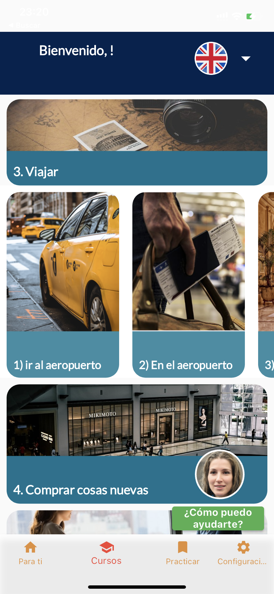
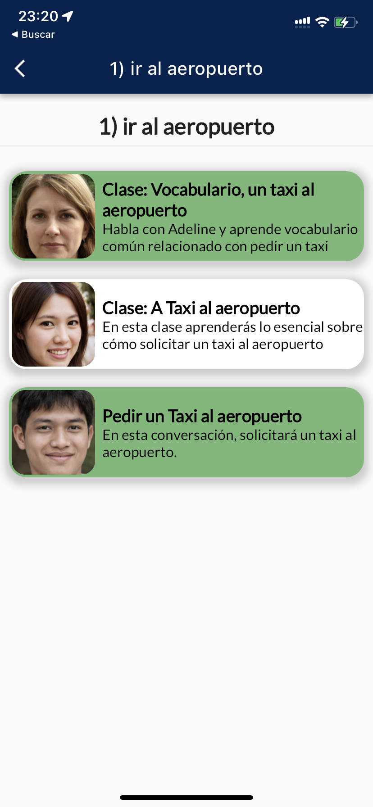
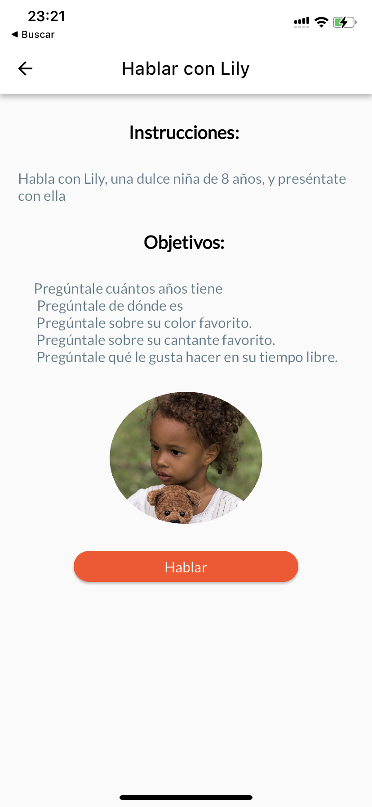
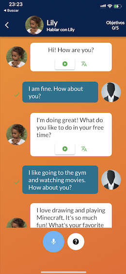
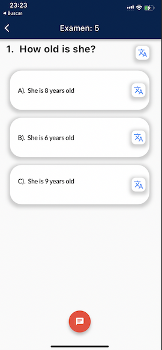

# AllesApp
El repositorio es privado, esto es solo con fines de demostrar mi experiencia laboral.

Alles es una app para aprender idiomas tomando clases con inteligencias artificiales que actuan como profesores y también teniendo conversaciones para prácticar situaciones de la vida real.

La app se cuentra disponible en App Store y Play Store
Android:
play.google.com/store/apps/details?id=alles.com.mx.alles_v1&hl=es_MX&gl=US&pli=1
App Store:
apps.apple.com/us/app/alles-languages-with-ai/id1613048675

## Features
- **Interfaz Amigable**

- **Conversaciones y clases por Inteligencias Artificiales**

- **Quizes de aprendizaje**

